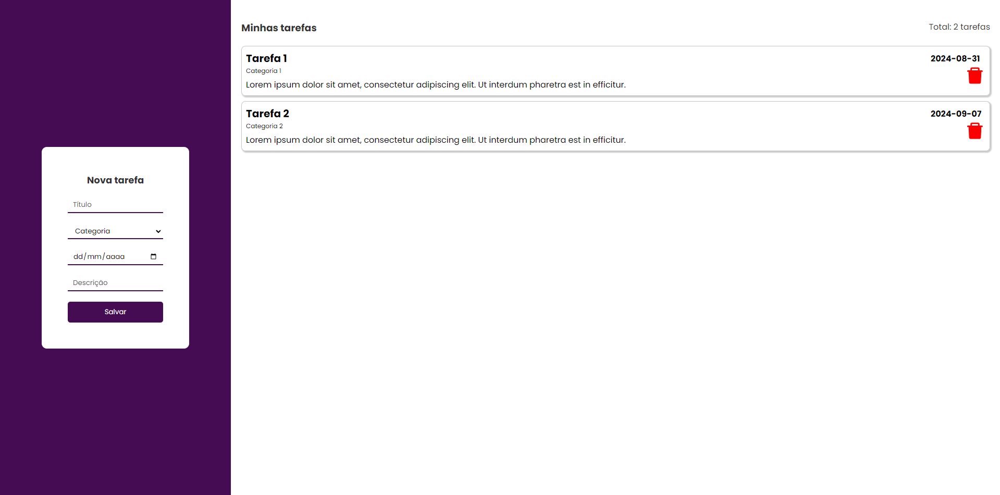

[REACT__BADGE]: https://img.shields.io/badge/React-005CFE?style=for-the-badge&logo=react
[PROJECT__URL]: https://github.com/pmarchiori/ToDoList-React

<h1 align="center" style="font-weight: bold;">To Do List💻</h1>

![react][REACT__BADGE]

<p align="center">
 <a href="#about">About</a> • 
 <a href="#started">Getting Started</a> • 
  <a href="#started">App Routes</a> • 
  <a href="#colab">Collaborators</a> •
 <a href="#contribute">Contribute</a>
</p>


<p align="center">
    
</p>

<h2 id="started">📌 About</h2>

Simple To do list made with React, with the purpose of studying and learning about react states.

<h2 id="started">🚀 Running the project locally</h2>

<h3>Prerequisites</h3>

- NodeJS
- npm or yarn
  
<h3>Installing</h3>

- Clone the repository
- 


<h3>Starting</h3>

How to start your project

```bash
cd project-name
npm some-command-to-run
```

<h2 id="routes">📍 Application Routes</h2>

Here you can list the main routes of your API, and what are their expected request bodies.
​
| route               | description                                          
|----------------------|-----------------------------------------------------
| <kbd>/authenticate</kbd>     | page that list all user info
| <kbd>/login</kbd>     | page to login
| <kbd>/dashboard</kbd>     | page that contains all user shopping and spences info

<h2 id="colab">🤝 Collaborators</h2>

Special thank you for all people that contributed for this project.

<table>
  <tr>
    <td align="center">
      <a href="#">
        <br>
        <sub>
          <b>Fernanda Kipper</b>
        </sub>
      </a>
    </td>
    <td align="center">
      <a href="#">
        <br>
        <sub>
          <b>Elon Musk</b>
        </sub>
      </a>
    </td>
    <td align="center">
      <a href="#">
        <br>
        <sub>
          <b>Steve Jobs</b>
        </sub>
      </a>
    </td>
  </tr>
</table>

<h2 id="contribute">📫 Contribute</h2>

Here you will explain how other developers can contribute to your project. For example, explaining how can create their branches, which patterns to follow and how to open an pull request

1. `git clone https://github.com/Fernanda-Kipper/text-editor.git`
2. `git checkout -b feature/NAME`
3. Follow commit patterns
4. Open a Pull Request explaining the problem solved or feature made, if exists, append screenshot of visual modifications and wait for the review!
